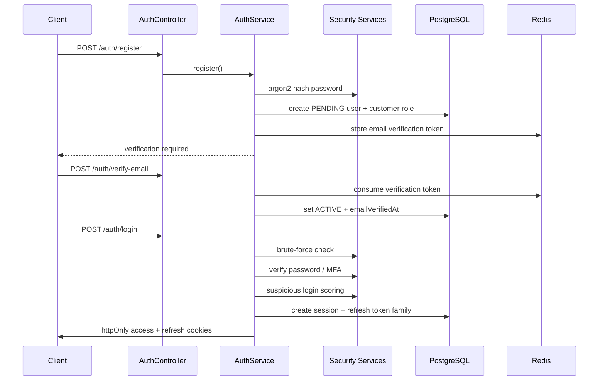
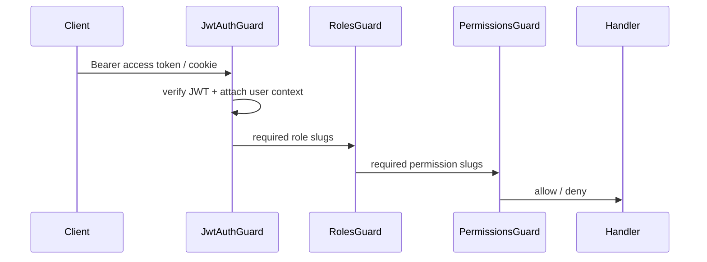
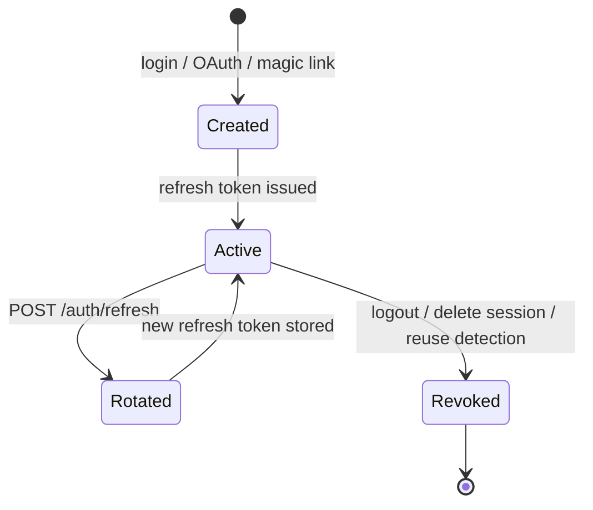

# NOVAEX Enterprise Authentication & Authorization

Production authentication, authorization, session management, and security controls for the NOVAEX API.

## Modules

| Module | Responsibility |
| --- | --- |
| `AuthModule` | Registration, login, MFA, password lifecycle, OAuth, profile |
| `SessionModule` | Multi-device sessions, revocation, device metadata |
| `AuthorizationModule` | RBAC roles, permissions, hierarchical assignments |
| `SecurityModule` | Password hashing, JWT, brute-force protection, cookies, MFA |

## Authentication Flow

## Authorization Flow

Global guards are registered in `AppModule`:

- `ThrottlerGuard` — rate limiting
- `JwtAuthGuard` — JWT validation (skips `@Public()` routes)
- `RolesGuard` — role-based checks via `@Roles()`
- `PermissionsGuard` — permission checks via `@Permissions()`

## Session Lifecycle

Sessions are persisted in PostgreSQL (`Session` model). Refresh tokens use rotation with family revocation on reuse detection (stored in Redis + `RefreshToken` table).

## Security Controls

- **Passwords**: argon2id hashing, history enforcement, expiration policy
- **Tokens**: short-lived access JWT, rotating refresh tokens, replay blocking in Redis
- **Cookies**: `httpOnly`, `secure` in production, signed refresh cookie support
- **CSRF**: middleware enabled via `CSRF_ENABLED`
- **Brute force**: Redis counters + temporary account lockout
- **MFA**: TOTP (otplib) with hashed backup codes in `User.metadata.security`
- **Audit**: `AuditService` for security-sensitive mutations
- **Security logs**: `SecurityLog` records login, logout, OAuth, suspicious activity

## API Endpoints

### Public

- `POST /auth/register`
- `POST /auth/verify-email`
- `POST /auth/resend-verification`
- `POST /auth/login`
- `POST /auth/vendor/login`
- `POST /auth/admin/login`
- `POST /auth/super-admin/login`
- `POST /auth/refresh`
- `POST /auth/forgot-password`
- `POST /auth/reset-password`
- `POST /auth/magic-link/request`
- `POST /auth/magic-link/verify`
- `POST /auth/otp/request`
- `POST /auth/otp/verify`
- `GET /auth/oauth/providers`
- `GET /auth/oauth/google` / `callback` (when configured)
- `GET /auth/oauth/github` / `callback` (when configured)

### Authenticated

- `POST /auth/logout`
- `PATCH /auth/change-password`
- `POST /auth/mfa/setup|enable|disable`
- `GET /auth/me`
- `PATCH /auth/profile`
- `PATCH /auth/email`
- `GET /auth/security/settings`
- `PATCH /auth/security/settings`
- `GET /auth/security/dashboard`
- `GET /auth/sessions`
- `DELETE /auth/sessions/:sessionId`
- `DELETE /auth/sessions`

### Admin

- `GET /authorization/roles`
- `GET /authorization/permissions`
- `POST /authorization/roles/:roleId/permissions`
- `POST /auth/admin/unlock-account` (super-admin)

## Environment Variables

See `backend/.env.example` for the full list. Key auth settings:

- `JWT_ACCESS_SECRET`, `JWT_REFRESH_SECRET`, `JWT_*_EXPIRES_IN`
- `MFA_ISSUER`, `PASSWORD_EXPIRY_DAYS`
- `MAX_LOGIN_ATTEMPTS`, `LOCKOUT_WINDOW_MS`, `LOCKOUT_DURATION_MS`
- `GOOGLE_CLIENT_ID`, `GOOGLE_CLIENT_SECRET`, `GITHUB_CLIENT_ID`, `GITHUB_CLIENT_SECRET`
- `OAUTH_CALLBACK_BASE_URL`

## OAuth Architecture Notes

- **Google / GitHub**: enabled when client credentials are configured
- **Apple**: architecture-ready; requires Apple Sign In service ID, team ID, key ID, and private key in deployment secrets
- **Facebook**: architecture-ready; requires Facebook app credentials and production callback enablement

## CAPTCHA Architecture

CAPTCHA verification is designed as a pre-auth gate for high-risk flows (`register`, `login`, `forgot-password`) using a provider adapter in `SecurityModule`. Enable by supplying `CAPTCHA_PROVIDER` and `CAPTCHA_SECRET` in deployment configuration and invoking verification inside `AuthService` before credential checks.
