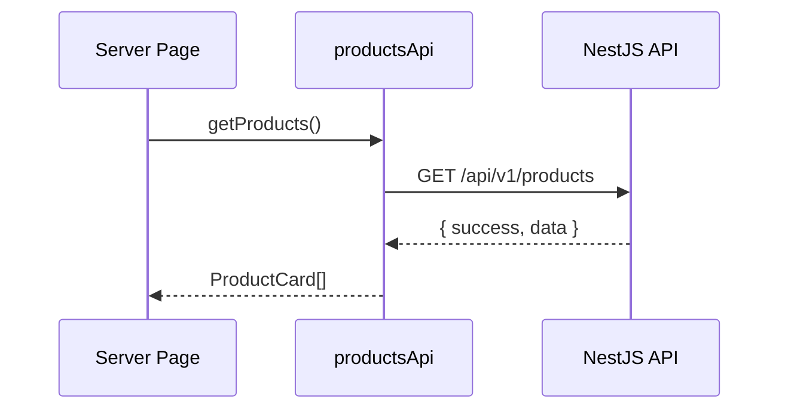

# NOVAEX Frontend Foundation

## Design system

The frontend uses Tailwind CSS 4 design tokens in `src/app/globals.css`:

- Typography: Inter (`--font-sans`) + Sora (`--font-display`)
- Color system: HSL semantic tokens for light/dark themes
- Glassmorphism utilities: `.glass-panel`, `.glass-panel-strong`
- Motion tokens: `src/lib/animations.ts`
- Component variants: shadcn-style CVA buttons, badges, cards

## Route groups

```mermaid
flowchart TD
  Root[app/layout.tsx] --> Marketing[(marketing)]
  Root --> Auth[(auth)]
  Root --> Commerce[(commerce)]
  Root --> Account[(account)]
  Marketing --> Home[/]
  Marketing --> AI[/ai]
  Commerce --> Products[/products]
  Auth --> Login[/login]
  Account --> Security[/account/security]
```

## Data flow



## Auth flow

Client auth forms call `authApi` and persist session state in `useAuthStore` (Zustand + localStorage). Refresh cookies are supported through `credentials: "include"` on fetch requests.

## Animation system

| Component | Purpose |
|---|---|
| `Reveal` | Scroll reveal animations |
| `PageTransition` | Route entry transitions |
| `MagneticButton` | Cursor magnetic CTA buttons |
| `ParallaxSection` | Scroll parallax sections |
| `AnimatedBackground` | Ambient floating gradients |
| `HeroScene` | React Three Fiber hero canvas |

## SEO

- `buildMetadata()` helper for Open Graph + Twitter cards
- `sitemap.ts` and `robots.ts`
- JSON-LD organization + website schema in root layout
